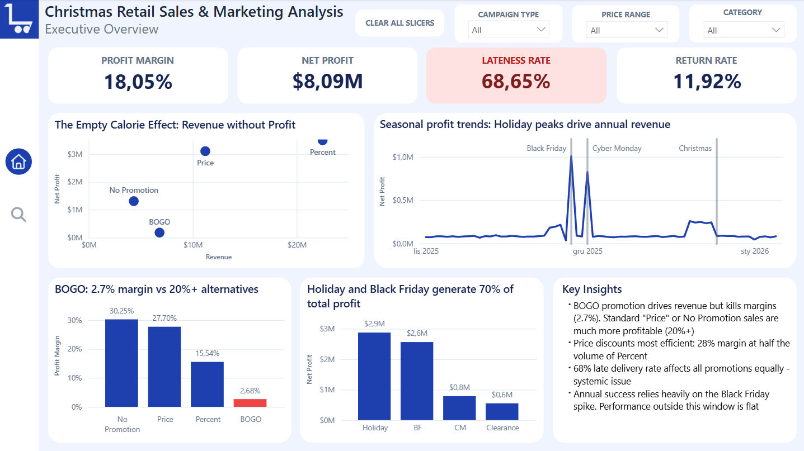
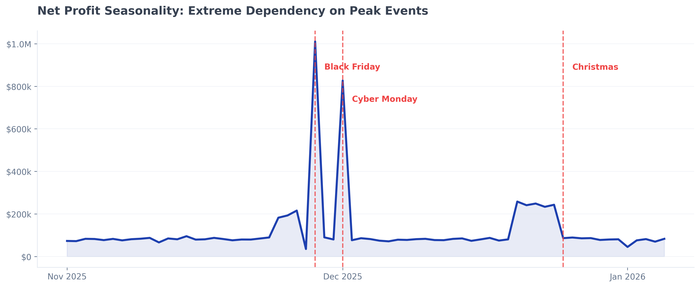
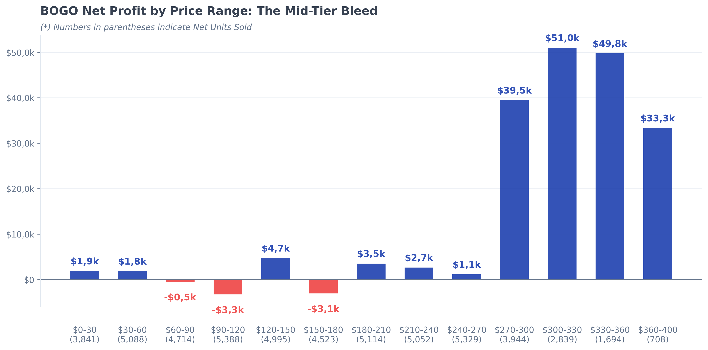
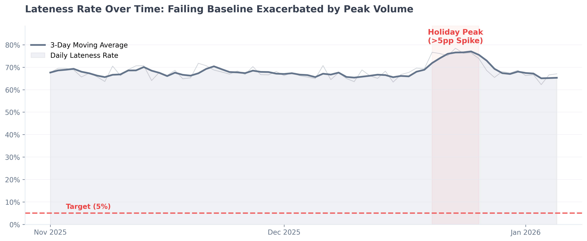

<h1>Christmas Retail Sales and Marketing Analysis</h1>

  <a href="https://app.powerbi.com/view?r=eyJrIjoiNWZiMmMzYWUtNTljMS00N2NiLWFmN2EtNWE0NDZlYmFkYTU2IiwidCI6ImRmODY3OWNkLWE4MGUtNDVkOC05OWFjLWM4M2VkN2ZmOTVhMCJ9&pageName=691e9632a8e16a59d5eb" target="_blank"><b>View Interactive Power BI Dashboard</b></a>

<h2>Introduction</h2>

<h3>Project Overview</h3>
This project analyzes Q4 holiday retail sales (Black Friday, Cyber Monday, Christmas) to evaluate the effectiveness of different marketing campaigns. The main goal was to identify profitability bottlenecks and assess operational performance during the peak season.

<h3>Key Metrics Analyzed</h3>

| Metric | Definition | Business Purpose |
|------------|----------------|----------------------|
| **Net Profit** | Revenue - COGS - Shipping - Refunds + Restock Fees | True Profitability after all costs|
| **Profit Margin** | Net Profit/Revenue | Efficiency of revenue generation |
| **Return Rate** | Returns/Total Orders | Customer satisfaction indicator |
| **Late Delivery Rate** | Late Orders/Total Orders | Operational Performance |

**Note:** ROI initially considered but excluded (`PlannedBudget` field unreliable - $33.5M = 75% of revenue - unrealistic for marketing spend, lack documentation)

<h2>Executive Summary</h2>

<h3>Key Findings</h3>

- **The BOGO Margin Trap:** While the BOGO (Buy One Get One) promotion generates high sales volume, it yields a severely low overall net profit margin of just **2.68%** (compared to a healthy 27.7% for Price discounts and 15.5% for Percent discounts).
- **Mid-Tier Margin Dilution:** Although BOGO is slightly profitable overall, the mid-range product segment ($60–$180) acts as a financial dead weight. Despite moving massive inventory volume, this specific tier mathematically zeros out, operating at a net loss of **~$7k**. It consumes massive logistical resources without contributing to the bottom line, severely diluting the entire campaign's performance.
- **Systemic Fulfillment Crisis:** The delivery network is structurally underperforming. The baseline, everyday **Lateness Rate sits at an unacceptable 68.65%**, a bottleneck that fractures even further under the stress of peak holiday volume.

 

<h1>Deep Dive Analysis</h1>

<h2>Seasonality and Profit Spikes</h2>

The daily net profit timeline reveals that Q4 profitability is entirely dicated by specific holiday events, which drive revenue in two distinct ways

- **The "Twin Peaks" (Black Friday & Cyber Monday):** These are the ultimate profit engines. Black Friday is a massive, single-day anomaly, generating over **$1.01M** in net profit in just 24 hours. Cyber Monday follows with a similar, sharp spike. These two days account for a disproportionate share of the total success
- **The Christmas Build-up (Sustained Volume):** Unlike the aggressive, one-day spikes of BF/CM, the period leading up to Christmas is a "marathon". While daily profit doesn't his the $1M mark, there is a sustained, multi-day elevation in sales. This consistent, day-over-day volume accumulates into a massive block of profit that is absolutely vital to the final bottom line.
- **The Flat Baseline:** Outside of these specific holiday windows (e.g., early November and post-Christmas January), the daily net profit immediately drops back to a very low, flat baseline. The business is highly vulnerable to any operational failures during these few critical weeks.

<h2>The BOGO "Bleed Zone"</h2>

The visual breakdown of BOGO performance by price range reveals a massive structural inefficiency. The promotional losses are not evenly distributed; they are heavily concentrated in very specific product tiers.

* **The Bleed Zone ($60-$120 & $150-$180):** These mid-tier products are fundamentally incompatible with the BOGO structure. Despite moving a massive volume of inventory (over 24,000 units combined), these two segments generated catastrophic net losses. The retail markup in this tier is simply not high enough to cover the Cost of Goods Sold (COGS) for the "free" unit.
* **The Premium Shield (Over $240):** Interestingly, premium items remain highly profitable under BOGO. Their built-in absolute margin is large enough to easily absorb the promotional cost, yielding over $170k in net profit. 
* **Low-Cost Viability (Under $60):** Cheap items also survive the BOGO cut, primarily because the absolute dollar cost of giving away a second cheap item is negligible.

**Strategic Takeaway:** The BOGO promotion is not entirely broken, but it is currently unmanaged. It is a viable strategy for clearing low-cost inventory or pushing high-margin premium goods, but it actively destroys value when applied indiscriminately to mid-range products. We must immediately implement "price-band gating" to exclude the $60-$180 items from future BOGO campaigns.

| Price Range | Units Sold (Qty) | Profit Margin | Net Profit |
| :---------- | ---------------: | ------------: | ---------: |
| $0 - 30 | 3841 | 3.30% | $1,866.39 |
| $30 - 60 | 5088 | 1.05% | $1,844.08 |
| **$60 - 90** | **4714** | **-0.19%** | **-$518.60** |
| **$90 - 120** | **5388** | **-0.77%** | **-$3,276.56** |
| $120 - 150 | 4995 | 0.92% | $4,736.11 |
| **$150 - 180** | **4523** | **-0.54%** | **-$3,056.09** |
| $180 - 210 | 5114 | 0.46% | $3,534.85 |
| $210 - 240 | 5052 | 0.31% | $2,663.07 |
| $240 - 270 | 5329 | 0.11% | $1,145.57 |
| $270 - 300 | 3944 | 4.72% | $39,497.57 |
| $300 - 330 | 2839 | 7.61% | $51,005.02 |
| $330 - 360 | 1694 | 11.33% | $49,751.02 |
| $360 - 400 | 708 | 16.07% | $33,334.03 |

<h2>Operations: The Systemic Fulfillment Crisis</h2>

  

While pricing strategies require targeted adjustments, the most critical risk to long-term customer retention lies in fulfillment operations. A time-series analysis of the shipping performance reveals a severe, two-fold logistical crisis:

* **Unacceptable Baseline:** Outside of peak events, the everyday Lateness Rate hovers around ~68%. This indicates a systemic failure in standard 3PL (Third-Party Logistics) operations, performing catastrophically below the industry standard target of ~5%.
* **The Holiday Breakdown:** Under the stress of the Christmas rush, the already compromised logistics network fractures further. The Lateness Rate spikes by an additional >5 percentage points, exactly at the moment when customer expectations for timely delivery are highest.

The fulfillment network is not just overwhelmed by Q4 peak volume; its everyday foundational processes are broken. Marketing investments (like BOGO) are effectively being wasted, as they push traffic into a supply chain that guarantees late delivery for over 7 out of 10 customers. An immediate audit of warehouse dispatch SLAs and carrier capacities is mandatory.

 

<h1>Recommendations</h1>

**1. Reposition BOGO as a Targeted Liquidation Tool**
* **Action:** Immediately exclude mid-tier products ($60 - $180) from general "Buy One Get One" campaigns. Transition the BOGO strategy strictly toward warehouse clearance (liquidating aging/dead stock) or highly targeted strategic pushes on select premium items.
* **Reasoning:** The retail markup in the mid-tier segment mathematically cannot support the COGS of a free unit. Using BOGO indiscriminately bleeds margin, whereas using it selectively transforms it into a powerful logistical tool to free up warehouse space and avoid long-term storage fees.

**2. Implement Dynamic Delivery Estimation Algorithms**
* **Action:** Investigate and overhaul the Estimated Delivery Time (EDT) engine displayed to customers at checkout. 
* **Reasoning:** A "late" order is fundamentally a failure to meet a set expectation. If the current static system promises standard 2-day shipping during Black Friday, it guarantees operational failure. Implementing an algorithm that dynamically adjusts delivery promises based on real-time warehouse backlog and historical carrier performance will immediately reduce the *calculated* lateness rate and protect brand trust.

**3. Audit 3PL SLAs and Fulfillment Operations**
* **Action:** Launch an immediate operational audit of the current fulfillment centers and Third-Party Logistics (3PL) partners.
* **Reasoning:** Even with better frontend estimation, the baseline operational delay (~68% lateness against current targets) is systemic. We must renegotiate warehouse dispatch SLAs (Service Level Agreements) to hit the industry standard of <5% delays during non-peak weeks, ensuring marketing budgets aren't driving traffic into a broken supply chain.

---
> **Note:** This analysis was created using **SQL** for data extraction and transformation, **Power BI (DAX)** for interactive modeling and baseline KPI calculations, and **Python (Pandas & Matplotlib)** for advanced time-series analysis and custom visualizations.